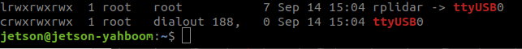
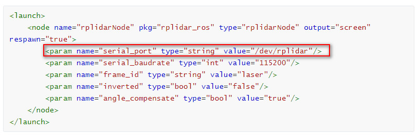
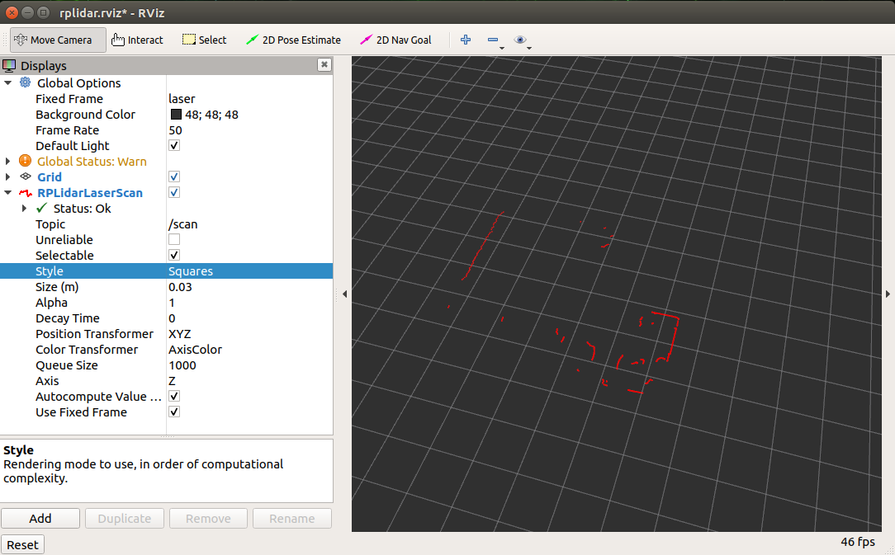
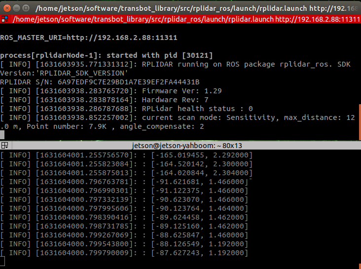

# 使用ROS操作Lidar

## 1. 运行rplidar节点

rplidar_ros功能包：https://github.com/Slamtec/rplidar_ros/

### 1.1 构建rplidar ros包

克隆功能包到src文件夹下

运行 catkin_make 来构建 rplidarNode 和 rplidarNodeClient

注意：如果没有将更新环境变量写到【.bahsrc】中，每次执行运行程序前，必须先更新环境变量。

````
source devel/setup.bash # 更新环境变量
````

### 1.2 重新映射USB串口

在rplidar_ros功能包路径下，安装 USB 端口重映射：

````
./scripts/create_udev_rules.sh
````

使用以下命令修改重映射：

````
ls -l /dev | grep ttyUSB
````



更改 USB 端口重新映射后，更改有关 serial_port 值的启动文件。



### 1.3 运行rplidar ros包

#### 1.3.1 在rviz中查看

````
roslaunch rplidar_ros view_rplidar_s1.launch # RPLIDAR S1
````



#### 1.3.2 查看原始数据

运行rplidar节点：

````
roslaunch rplidar_ros rplidar_s1.launch # RPLIDAR S1
````

启动测试应用程序：

`````
rosrun rplidar_ros rplidarNodeClient
`````

在控制台中看到 rplidar 的扫描结果


